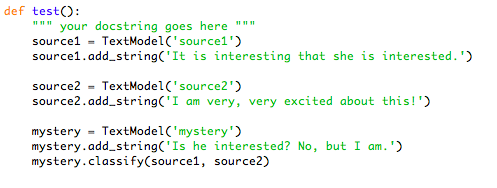
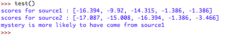

# Text-Identifier-Project
A python project of creating an algorithm for identifying an author of the passage based on comparisons with other texts.

## Table of contents
* [General info](#general-info)
* [Testing the Algorithm](#testing-the-algorithm)
* [Setup](#setup)
* [Status](#status)
* [Contact](#contact)

## General info
Statistical models of text are one way to quantify how similar one piece of text is to another. Such models were used as evidence that the book The Cuckoo’s Calling was written by J. K. Rowling (using the name Robert Galbraith) in the summer of 2013. That story seemed very interesting to me and motivated me to create such an algorithm on my own. 
Some of the techniques that can be used to identify an author of the text include analyzing similar patterns of used words, word and sentenses lengths, frequency of unique words and others. 

*Atributes used in the algorithm:* 
* Unique words
* Word lenghts
* Unique stems
* Sentence lengths
* Use of special characters

## Testing the Algorithm
To test my algorithm, I used Stephen King’s works and _The Fault in Our Stars_ by John Green as source bodies of texts. 
My new texts/bodies of texts were:
* _Canterbury Tales_ by Geoffrey Chaucer, 
* _The Running Man_ (a book written by Stephen King under a pseudonym), 
* a paper from the BU WR100 Journal titled _“Sylvia Plath: The Dialogue Between Poetry and Painting”_,
* _The Hunger Games_ by Suzanne Collins

In the end, the first two were more similar to Stephen King, whereas the second two resembled The Fault in Our Stars. I expected The Running Man to be similar to Stephen King’s work because it was written by him, just under a pseudonym. I also expected Canterbury Tales to be more like Stephen King’s work because it is an old piece of literature and Stephen King writes more formally than John Green. In the same way, I expected both the WR100 paper and The Hunger Games to resemble The Fault in Our Stars because they are more modern and casual in their style of writing.

Even though the algorithm is not 100% accurate and did not catch themes in the writing as much as I thought it would, it worked every time I compared a piece of work to something written by the same author. It could be more accurate if it had more elements to compare the pieces of text to make a more thorough comparison and longer texts input into the program, as it could have been more accurate because it would have had more data to choose from. 

## Setup
To test the code, you can simply have three short strings that you would put into `test()` command to look if the code is working correclty. 
To actually work with larger pieces, it is necessary to have three chuncks of text. Two of them would be used as source bodies, so, ideally, they should be as long as posiible, so that the programm had more data to analyze. Those two files will be saved by the code as "source1" and "source2" by the command `source1.add_file('name_of_file.txt')`. The third piece of text is the one you are trying to identify, which would be named "new". After that you can run the test and it will give you the result. 

## Code Examples
Example of comparing Canterbury Tales to John Green and Shakespeare:
`def  run_tests():
    source1 = TextModel('John Green')
    source1.add_file('fault_stars.txt')
    source2 = TextModel('Stephen King')
    source2.add_file('stephen_king.txt')
    new1 = TextModel('Canterbury Tales')
    new1.add_file('canterbury.txt')
    new1.classify(source1, source2) `

## Screenshots

## Status
Project is: _finished_

## Contact
Created by Ekaterina Gorbunova - feel free to contact me at eginfo@bu.edu!
